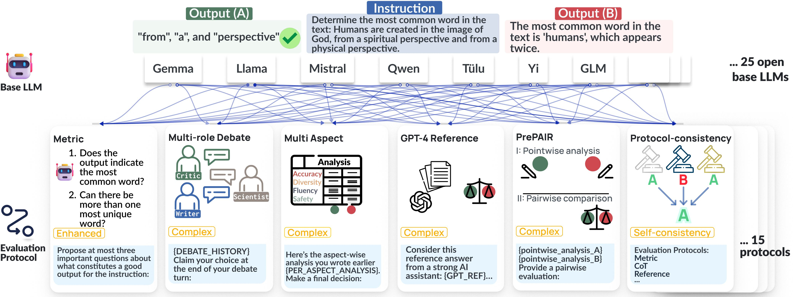

# ReIFE

This repo contains the code for our work "ReIFE: Re-evaluating Instruction-Following Evaluation".

## Quick Links

- [Datasets](#datasets)
- [Getting Started](#getting-started)
- [Folder Structure](#folder-structure)
    - [Important Files](#important-files)
- [Evaluating a new LLM-evaluator](#evaluating-a-new-llm-evaluator)
    - [Step 1: Add a new base LLM](#step-1-add-a-new-base-llm)
    - [Step 2: Add a new evaluation protocol](#step-2-add-a-new-evaluation-protocol)
        - [Evaluator](#evaluator)
        - [Evaluation Method and Parser](#evaluation-method-and-parser)
        - [Adding Prompts](#adding-prompts)
    - [Step 3: Run the evaluation](#step-3-run-the-evaluation)
    - [Step 4: Meta-evaluation](#step-4-meta-evaluation)
- [Demo](#demo)

## Datasets

The evaluation results of our work can be accessed as a Hugging Face Dataset: [yale-nlp/ReIFE](https://huggingface.co/datasets/yale-nlp/ReIFE).

It contains two subsets: `src` and `predictions`. The `src` subset contains the source datasets for evaluating LLM-evaluators. The `predictions` subset contains the evaluation results of the LLM-evaluators.

The source datasets are from the following previous works (please cite them if you use the datasets):
- [LLMBar](https://github.com/princeton-nlp/LLMBar?tab=readme-ov-file#hugging-face-datasets)
- [MTBench](https://github.com/lm-sys/FastChat/tree/main/fastchat/llm_judge#datasets)
- [InstruSum](https://github.com/yale-nlp/InstruSum?tab=readme-ov-file#benchmark-dataset)

The `predictions` subset contains the evaluation results of the 450 LLM-evaluators, consisting of 25 base LLMs and 18 evaluation protocols. The evaluation results are in the JSONL format. Each line is a JSON object containing the evaluation results of an LLM-evaluator on a dataset.

We provide a notebook to analyze the evaluation results: [`meta_eval.ipynb`](meta_eval.ipynb).


## Getting Started

### Clone the Repository without result files

Our repo contains a large number of raw result files under the `results/` directory. If you want to clone the repository without the result files, you can run the following commands (may not work with git versions older than 2.25):

```bash
git clone --filter=blob:none --no-checkout git@github.com:yale-nlp/ReIFE.git
cd ReIFE
git sparse-checkout init --no-cone
bash sparse_checkout.sh
```

### Installation

Python >= 3.10 is required to run the code.
`transformers` and `vllm` are required to run the code.

#### Installation with CUDA 12.1
```bash
pip install torch==2.4.0 torchvision==0.19.0 torchaudio==2.4.0 --index-url https://download.pytorch.org/whl/cu121
pip install transformers==4.44.0
pip install vllm==0.5.4
pip install flash-attn --no-build-isolation
```

#### Installation with CUDA 11.8 with the latest PyTorch
```bash
pip install torch torchvision torchaudio --index-url https://download.pytorch.org/whl/cu118
pip install transformers
pip install https://github.com/vllm-project/vllm/releases/download/v0.5.4/vllm-0.5.4+cu118-cp310-cp310-manylinux1_x86_64.whl --extra-index-url https://download.pytorch.org/whl/cu118
pip install flash-attn --no-build-isolation
```


## Folder Structure

- `configs/`: Contains the configuration files of different evaluation protocols.
- `data/`: Contains the datasets used for the evaluation.
- `ReIFE/`: Contains the main source code.
    - `./methods/`: Contains the code for the evaluation methods (protocols).
    - `./models/`: Contains the code for the base LLM models.
- `logs/`: Contains the logs of the evaluation.
- `misc/`: Miscellaneous files for running meta-evaluation.
- `prompts/`: Contains the prompts used for the evaluation.
- `results/`: Contains the results of the evaluation.
    - `./cache/`: Contains the cache indermediate results.
    - `./meta_eval_cache/`: Contains the cache for the meta-evaluation.
    - `./outputs/`: Contains the raw outputs of the evaluation.
- `tests/`: Contains simple tests for the codebase.

### Important Files

- `run.py`: The main file to run the evaluation.
- `run.sh`: A script to reproduce all the results.
- `meta_eval.py`: The file to run the meta-evaluation.
- `meta_eval.sh`: A script to run the meta-evaluation.
- `helpers.py`: Contains helper functions.
- `ReIFE/base_llm.py`: Contains the base class for the LLM models. Each LLM model should inherit from this class.
- `ReIFE/evaluator.py`: Defines the main evaluator class.

## Run Experiments

### Reproducing the Results

To reproduce the results, you can simply run the `run.sh` script. The script will run the evaluation of the 15 base LLMs and the 25 protocols on the 4 datasets. The results will be saved in the `results/` directory. `run.sh` also contains the information about the base LLMs and the 25 protocols.

### Analyzing the Results

The results of the evaluation are saved in the `results/` directory. The results are saved in the JSONL format.
You can run `meta_eval.sh` to run the meta-evaluation.

## Evaluating a new LLM-evaluator

### Step 1: Add a new base LLM

If you want to evaluate a new LLM, you need to add a new class in [`ReIFE/models/`](ReIFE/models/) that inherits from [`ReIFE/base_llm.py`](ReIFE/base_llm.py).
Here is an example: [`ReIFE/models/llama2.py`](ReIFE/models/llama2.py).

Each LLM should be a child class of `ReIFE.base_llm.BaseLLM`, `ReIFE.base_llm.BaseVLLM` or `ReIFE.base_llm.BaseLLMAPI`
`BaseLLM` is in essence a wrapper around the `transformers` library, `BaseVLLM` is a wrapper around the `vllm` library.
`BaseVLLM` is more suitable for *decoding* tasks because of its efficiency, while `BaseLLM` is more suitable for *scoring* tasks because of its transparency. 
`BaseLLMAPI` defines the interface for running LLMs through an API (e.g., OpenAI's API).
It provides basic functionalities such as multi-threading and retrying.
To add a new LLM, it is usually enough to implement the `__init__` and any abstract methods in the base class.

When adding a new model, please register it using `ReIFE.models.registry.register_model` in [`ReIFE/models/registry.py`](ReIFE/models/registry.py). Also, please import the new module/model in [`ReIFE/models/__init__.py`](ReIFE/models/__init__.py).

### Step 2: Add a new evaluation protocol

Adding new evaluation methods (protocols) is somewhat more involved. 

#### Evaluator

First let's look at the [evaluator](ReIFE/evaluator.py), which is the main class for the evaluation:

```python
class PairwiseEvaluator:
    def __init__(
        self,
        model: BaseLLM | BaseVLLM | None = None,
    ) -> None:
        """
        Initialize the Evaluator object.

        Args:
            model: The model to be evaluated. It should be an instance of BaseLLM or BaseVLLM.
        """
        self.model = model
```

Let's look at its `pairwise_eval` method:

```python
def pairwise_eval(
    self,
    eval_fn: BasePairwiseEvalType,
    input_dir: str,
    output_dir: str,
    prompt_dir: str,
    batch_size: int = 1,
    output_text_dir: str | None = None,
    temperature: float = 1.0,
    top_p: float = 1.0,
    n: int = 1,
    max_tokens: int = 512,
    logprobs: int | None = None,
    parse_fn: BasePairwiseParseType | None = None,
    no_model: bool = False,
    verbose: bool = False,
    **kwargs,
) -> tuple[int, list[int]]:
    """
    Perform pairwise evaluation.

    Args:
        eval_fn: The evaluation function to be used.
        input_dir: The directory containing the input data. It should be a jsonl file.
        output_dir: The directory to save the evaluation output.
        prompt_dir: The directory containing the prompt data.
        batch_size: The batch size for evaluation.
        output_text_dir: The directory to save the output text.
        temperature: The temperature for sampling.
        top_p: The top-p value for sampling.
        n: The number of samples to generate.
        max_tokens: The maximum number of generated tokens for each sample.
        logprobs: The number of log probabilities to output.
        parse_fn: The function to parse the output.
        no_model: Whether a model is not needed.
        verbose: Whether to print verbose output.
        kwargs: Additional keyword arguments for the evaluation function.

    Returns:
        tuple[int, list[int]]: The number of fails and the list of winners.
    """
```

This function takes an evaluation function `eval_fn` as a callback function. And it takes a parsing function `parse_fn` as an optional callback function. The evaluator will call the `eval_fn` with `self.model` to run the evaluation. The `parse_fn` is used to parse the output of the evaluation function.

Here is an example of an evaluation function ([`ReIFE/methods/base_pairwise.base_pairwise_eval`](ReIFE/methods/base_pairwise.base_pairwise_eval)):

```python
def base_pairwise_eval(
    model: BaseLLM | BaseVLLM | BaseLLMAPI,
    data: list[dict],
    output_dir: str,
    prompt_dir: str,
    batch_size: int,
    instruction_marker: str,
    output_marker: str,
    output_text_dir: str | None = None,
    temperature: float = 1.0,
    top_p: float = 1.0,
    n: int = 1,
    max_tokens: int = 512,
    logprobs: int | None = None,
    verbose: bool = False,
    **kwargs,
) -> None:
    """
    Perform pairwise evaluation.

    Args:
        model: The model to evaluate.
        data: The data to evaluate.
        output_dir: The directory to save the evaluation output.
        prompt_dir: The directory containing the prompt data.
        batch_size: The batch size for evaluation.
        instruction_marker: The marker for the instruction.
        output_marker: The marker for the output.
        output_text_dir: The directory to save the output text.
        temperature: The temperature for sampling.
        top_p: The top-p value for sampling.
        n: The number of samples to generate.
        max_tokens: The maximum number of generated tokens for each sample.
        logprobs: The number of log probabilities to output.
        verbose: Whether to print verbose output.
        kwargs: Additional keyword arguments for the evaluation function.

    Returns:
        None
    """
```

Note that you can extend the `base_pairwise_eval` function to include additional arguments.

Here is an example of a parsing function ([`ReIFE/methods/base_pairwise.base_pairwise_parse`](ReIFE/methods/base_pairwise.base_pairwise_parse)):

```python
def base_pairwise_parse(
    data: dict,
    sys1_marker: str = "m",
    sys2_marker: str = "M",
    pattern: str | None = None,
    verbose: bool = False,
) -> tuple[dict, bool]:
    """
    Parse the response from the model.

    Args:
        data: The data to be parsed.
        sys1_marker: The marker for system 1.
        sys2_marker: The marker for system 2.
        pattern: The pattern to match the response.
        verbose: Whether to print verbose output.

    Returns:
        tuple[dict, bool]: The parsed response and whether the parsing failed.
    """
```

You have even more flexibility with the parsing function, as long as the return value is a dictionary and a boolean value indicating whether the parsing fails. For the dictionary, you can include any information you want to return, and **the only requirement is that it should include a key `winner` that indicates the winner of the comparison, with 1 for the first system and 2 for the second system**.

**Note**: The evaluation function and the parsing function are entangled. With both of them, there is a lot of flexibility in the evaluation process. The parsing function takes in the result of the evaluation function (`data`) and returns the parsed result. The parsed result is then used to determine the winner of the comparison.

#### Evaluation Method and Parser

To add a new evaluation/parsing method, add them in a new or existing file in [`ReIFE/methods/`](ReIFE/methods/). Then register them using `ReIFE.methods.registry.register_method` and `ReIFE.methods.registry.register_parser` in [`ReIFE/methods/registry.py`](ReIFE/methods/registry.py). Also, please import the new module/method in [`ReIFE/methods/__init__.py`](ReIFE/methods/__init__.py). Creating new files for new methods is recommended for better organization.

#### Adding Prompts

A new prompt is usually needed when adding a new evaluation method. [`prompts/`](prompts/) is the directory to store the prompts.

The prompt should follow the [ChatML](https://github.com/MicrosoftDocs/azure-docs/blob/main/articles/ai-services/openai/includes/chat-markup-language.md) format:

```txt
<|im_start|>system 
Provide some context and/or instructions to the model.
<|im_end|> 
<|im_start|>user 
The user's message goes here
<|im_end|> 
<|im_start|>assistant
The model's response goes here
<|im_end|>
```

In the corresponding evaluation method, `.format_map()` can be used to replace the placeholders with the actual context and instructions. For example:

```txt
# Instruction:
{INSTRUCTION}
```

```python
prompt = prompt.format_map({"INSTRUCTION": "Provide some context and/or instructions to the model."})
```


### Step 3: Run the evaluation

#### Running the evaluation with a VLLM model

To run the evaluation with a model inherited from the BaseVLLM class, you can use the `run.py` script. Here is an example:

```bash
python run.py \
    --model_pt "TheBloke/tulu-2-dpo-70B-AWQ" \
    --model_name "tulu-2-dpo-70b-awq" \
    --model_cls "tulu2vllm" \
    --tensor_parallel_size 1 \
    --gpu_memory_utilization 0.9 \
    --quantization AWQ \
    --batch_size 8 \
    --swap_space 8 \
    --download_dir $HOME/.cache/huggingface/hub \
    --verbose \
    --config_dir configs/pairwise_base.yaml \
    --datasets llmbar_natural llmbar_adversarial mtbench instrusum
```

Note that you can use the `--config_dir` option to specify the configuration file. The configuration file is a YAML file that contains the configuration for the evaluation. Here is an example of a configuration file:

```yaml
# model configs
max_input_len: 4096
max_model_len: 4608

# eval config
eval_method: 'base_pairwise'
prompt_method: 'pairwise_vanilla'
instruction_marker: 'INSTRUCTION'
output_marker: 'OUTPUT'

# parse config
parse_method: 'base_pairwise'
sys1_marker: 'a'
sys2_marker: 'b'
pattern: 'Output \((.*?)\)'
parse_with_tokenizer: false

eval_kwargs: # arguments for eval function
  temperature: 0.0
  top_p: 1.0
  n: 1
  max_tokens: 64
  logprobs: 32
```

As you can see, the configuration file is coupled with the evaluation method and the parsing method. You can customize the configuration file to include additional arguments for the evaluation function and the parsing function.

#### Running the evaluation with an API model

The process of running the evaluation with an API model is similar to running the evaluation with a VLLM model. Here is an example:

```bash
python run.py \
    --model_pt gpt-4o-mini \
    --model_name gpt-4o-mini \
    --model_cls "gpt" \
    --batch_size 32 \
    --parallel_size 8 \
    --config_dir configs/gpt/pairwise_base.yaml \
    --datasets llmbar_natural llmbar_adversarial mtbench instrusum \
    --key_path keys/openai.key \
    --account_path keys/openai.org
```
An example configuration file is at [`configs/gpt/pairwise_base.yaml`](configs/gpt/pairwise_base.yaml).

### Step 4: Meta-evaluation

To run the meta-evaluation, you can use the `meta_eval.py` script. Here is an example:

```bash
python meta_eval.py \
    --config_dir misc/evaluators.yaml \
    --datasets llmbar_natural llmbar_adversarial mtbench instrusum
```

The `evaluators.yaml` file is a YAML file that contains the configuration for the meta-evaluation. Here is an example of a configuration file:

```yaml
- name: 'base_cot'
  fdir: 'tulu-2-dpo-70b-awq.base_pairwise.pairwise_vanilla'
  bidirectional: false
```

The `fdir` field is the directory of the evaluation results. The `bidirectional` field is a boolean value indicating whether the evaluation is bidirectional. If `bidirectional` is `true`, the evaluation is bidirectional, such that it will look for both `results/{dataset}.{fdir}.jsonl` and `results/{dataset}.{fdir}_swap.jsonl`. If `bidirectional` is `false`, the evaluation is unidirectional, such that it will look for only `results/{dataset}.{fdir}.jsonl`.

## Demo

Please see `demo.py` for a demo of the evaluation process.
